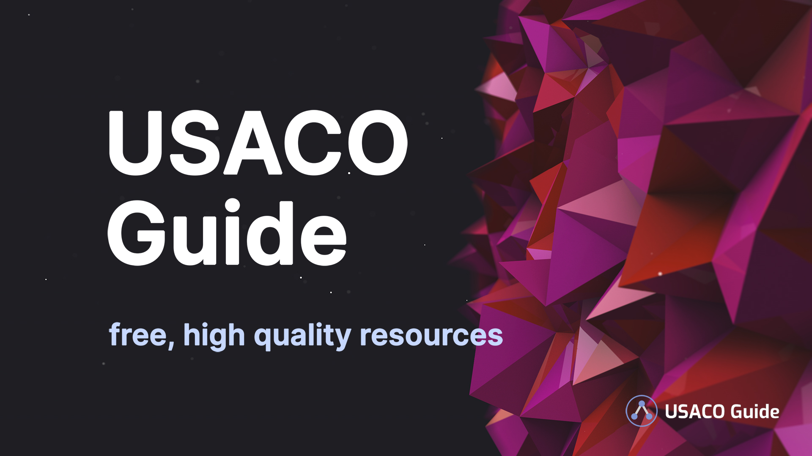

## Свържете се с нас

Моля, помогнете ни да подобрим този сайт, като дадете **обратна връзка** чрез бутона
„Връзка с нас“<Asterisk>Намира се в долния ляв ъгъл на екрана. Ако не можете
да го видите, отворете страничното меню, като щракнете върху иконата в горния ляв
ъгъл.</Asterisk> 
Можете да дадете обратна връзка за всичко!

Ако сте намерили сайта ни за полезен или сте се затруднили, докато го използвате,
моля, уведомете ни! :)

## За този сайт

<Warning title="Този сайт НЕ е учебна програма!!">

Темите в този сайт отразяват минали задачи, а не бъдещи. Задачите в състезанията
може да съдържат теми, които не са споменати в този сайт (макар и много невероятно).

</Warning>

Най-напред сайтът е предназначен за ученици от 9 до 12 клас, участващи в
състезания по физика или астрономия. Материалът тук обхваща всичко до нивото на
IPhO и отвъд. Скоро ще има възможност за избор на класа, в който учите, и ще има
нови модули, ориентирани към по-младите състезатели.

**Забележка:** В момента се фокусираме върху написването на модулите, подходящи за
специална тема. Модулите за 9-10 клас ще останат предимно незавършени за момента.

## Как да използвате сайта?

- Използвайте падащите менюта за **Напредък по модула** (отдясно на заглавието
	на модула или в долната част на страницата), за да следите напредъка си по този
	сайт! Промените ще бъдат отразени от лентата за навигация вляво.

- Ако се затрудните, потърсете помощ във **[форума на Olympiads.xyz](http://olympiads.xyz/forums "форума на Olympiads.xyz")**,
	неофициален форум за въпроси и отговори за олимпийци в България.

- Прочетете всички ресурси маркирани със звезда, преди да продължите!

- Силно препоръчваме да решите всички задачи маркирани със звезда. Ако имате
	нужда от повече практика, опитайте някои от тези без звезда.
    - Трудността представлява колко предизвикателна се очаква да бъде дадена
		задача за някого, след като прочете модула, и **не** е сравнима между модулите.

- **Прескачането** на някои теми е особено препоръчително за състезатели, които
	вече имат опит в дадена тема на високо ниво. Чувствайте се свободни да маркирате
	модул като „Пропуснат“ и да се върнете към него по-късно!

## Създаване на акаунт

Силно Ви препоръчваме да създадете акаунт, като щракнете върху бутона „Настройки“
в долния ляв ъгъл на екрана (или в страничното меню на мобилно устройство).
По този начин Вашите настройки и напредъкът Ви ще бъдат запазени на нашите
сървъри и синхронизирани между отделни устройства.

## За преподаватели

Ако сте учител, преподаващ _безплатно_, моля, не се колебайте да използвате
каквито искате части от този сайт, но моля, предоставете кредит + връзка
към този сайт! Освен това не се колебайте [да се свържете с нас](mailto:olympiads.xyz@gmail.com),
ако имате конкретни предложения за какъв материал бихте намерили за полезен.